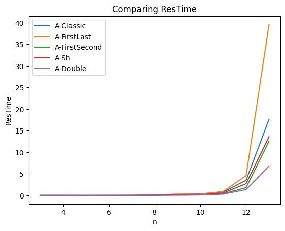

---
title: "AllIntervalSeries"
author: "Fissore Davide"
date: "2022-05-30"
caption-justification: centering
...

This folder contains some implementation to solve the *[All-Series Interval](https://www.csplib.org/Problems/prob007/)* problem with *Choco solver* in Java. The jar file is named *"LaunchMe.avi"*.

# The problem

>**Input :** an integer n  
**Output :** find all vectors $s = (s_1, s_2, \dots, s_n)$ such that : 

> - $s$ is a permutation of $Z_n = 0,1,\dots,n-1$ and
>
> - there exists a vector $dist$ such that $dist = (|s_2 - s_1|, |s_3 - s_2|, \dots, |s_n - s_{n-1}|)$ is a permutation of $Z_n = 1, 2, \dots, n-1$. 
>
> A vector $s$ satisfying these conditions is called an *all-interval series* of size $n$.

# Problem analysis

When looking at solutions, we have a table like this :

| n   | # solutions | remark                 |
| --- | ----------- | ---------------------- |
| 3   | 4           | $4 \equiv 0 \mod 4$    |
| 4   | 4           | $4 \equiv 0 \mod 4$    |
| 5   | 8           | $8 \equiv 0 \mod 4$    |
| 6   | 24          | $24 \equiv 0 \mod 4$   |
| 7   | 32          | $32 \equiv 0 \mod 4$   |
| 8   | 40          | $40 \equiv 0 \mod 4$   |
| 9   | 120         | $120 \equiv 0 \mod 4$  |
| 10  | 296         | $196 \equiv 0 \mod 4$  |
| 11  | 648         | $648 \equiv 0 \mod 4$  |
| 12  | 1328        | $1328 \equiv 0 \mod 4$ |
| 13  | 3200        | $3200 \equiv 0 \mod 4$ |

And we can see that every solution is a multiple of 4. This let me think that there should exists at least two big symmetries that, once applied, can find only a quarter of the total number of solutions. (It is useless to calculate a solution $S_1$ and a solution $S_2$ if $S_2$ can be derived from $S_1$ applying the symmetry found - as we have seen in our course for the symmetries applied to the chess board).

## The $R^{180}$ symmetry
The simpler symmetry that I could spot was the symmetry that I will call $R^{1580}$. By this symmetry, given $S_1 = (s_1, s_2, \dots, s_n)$ we can deduce $S_2 = (s_n, s_{n-1}, \dots, s_1)$ which is also a solution of the problem. 

In order to avoid $R^{180}$ to be calculated,  we can force an order on two of variables of $s$, for example we can say that $s_1 < s_2$ or $s_1 < s_2$ or $s_1 < s_n$. In any case, we see that when we force a variable $s_i$ to be strictly smaller than a variable $s_j$ (with $i \neq j$), we can halve the number of solutions.

## The $S_h$ symmetry

I have passed a lot of time to figure out how to find the second symmetry to half again the number of solution. But the only way I was able to find it was by looking at the solutions of the problem for $n = 5$ (the solutions of this problem are short and they are not very much).

For $n = 5$:  

- $s_1 = [4, 0, 3, 1, 2]$ and $d_1 = [4, 3, 2, 1]$ 
- $s_2 = [1, 2, 4, 0, 3]$ and $d_2 = [1, 2, 4, 3]$

___

- $s_3 = [0, 4, 1, 3, 2]$ and $d_3 = [4, 3, 2, 1]$
- $s_4 = [3, 2, 0, 4, 1]$ and $d_4 = [1, 2, 4, 3]$ 

___

- $s_5 = [2, 1, 3, 0, 4]$ and $d_5 = [1, 2, 3, 4]$
- $s_6 = [3, 0, 4, 2, 1]$ and $d_6 = [3, 4, 2, 1]$

___

- $s_7 = [1, 4, 0, 2, 3]$ and $d_7 = [3, 4, 2, 1]$
- $s_8 = [2, 3, 1, 4, 0]$ and $d_8 = [1, 2, 3, 4]$ 

From this list, we see that for every solution $S_i$, there exist a solution $S_j$ which is obtained from $S_i$ by shifting the vector $s$ of a certain number of steps to the right. So, I also verified that this symmetry was also present for other $n \neq 5$ and I was able to see that this pattern does exist for any $n$. I will call this symmetry $S_h$ (for shift).
Moreover, let $p$ the position of $dist_i \in dist$ such that $dist_i = |s_0 - s_{n-1}|$ then the shift is of $n - p$ steps to the right.

Let $N$ be the number of all of the solution for a given $n$, then if we combined the $R^{180}$ with the $S_h$ rule, then, we obtain $\#solution = \frac{1}{4} \times N$, and for $n = 5$ the only solutions are $2 = \frac{8}{4}$:

  - $s_2 = [1, 2, 4, 0, 3]$ 
  - $s_8 = [2, 3, 1, 4, 0]$

Where the other one can be found as follows :

- $s_6 = [3, 0, 4, 2, 1] = R^{180}(s_2)$
- $s_3 = [0, 4, 1, 3, 2] = R^{180}(s_8)$

___
 
- $s_1 = [4, 0, 3, 1, 2] = S_h(s_2)$ 
- $s_7 = [1, 4, 0, 2, 3] = S_h(s_8)$ 

___

- $s_5 = [2, 1, 3, 0, 4] = R^{180}(S_h(s_2))$
- $s_4 = [3, 2, 0, 4, 1] = R^{180}(S_h(s_8))$

# My solvers

In the java project, I have created an *abstract*  class representing my *Solvers*. This class has some utility functions allowing to print statistics in CSV format and to print the solutions found line by line (This is the trick I used to find the two symmetries of the problem).

Moreover, in this *abstract class* I define the two vectors of *IntVar* $s$ and $dist$.

Where :   

- s = an array of length n (every $s_i \in s$ has domain $[0..n-1]$)  
- dist = a vector of length $n-1$ (every $dist_i \in dist$ has domain $[1..n-1]$)

With : 

1. *AllDiff(s)*  
2. *AllDiff(dist)*  

>Note : each solver, since it extends the *AbstractSolver*, owns the variables $s$ and $dist$

I have created $5$ versions of solvers and impelemented them both with the *arithm* constraint and the *table* method.

> Note : Solver with name *A-...* are solvers with *arithm* constraint and *T-...* are those using tables.

## The "Classic" solver 
The *Classic Solver* class creates a really simple solver which implements the constraints of the problem introducing them one by one.

### With Arithm
The added variables are : 

  - v = a vector of length $n-1$ (every $v_i \in v$ has domain $[-n..n]$)

The added constraints are : 

  1. $\forall i \in [0..n-2], v_i = s_i - s_{i+1}$  
  2. $\forall i \in [0..n-2], dist_i = |v_i|$  

Remark : 

- The constraint *AllDiff* on $v$ is not necessary, since it is implicitly verified by the two other two *AllDiff*s on $s$ and $dist$
- This solver finds all solutions

### With Table
The added variables are :  

  - triples = a vector of length is $n-1$ of triples 
  - tuples = a Tuples which will indicates the relationship between every triple of the vector triples.

The triples are encoded as follows :
$$\forall i \in [0..n-2], triples_i = \{s_i, s_{i+1}, dist_i\}$$

The tuples is created as follows :
$$\forall i \in [0..n-1], \forall j \in [0..i-1], tuples.add(i, j, |i-j|) \wedge tuples.add(j, i, |i-j|)$$

> Note : it is not necessary to test that $i \neq j$ since $i < j$ and $i, j$ and $j, i$ are added in tuples. 

> Note : This solver finds all solutions

## Avoid the $R^{180}$ symmetry
As said in Section [#the-r180-symmetry](#the-r180-symmetry), an improvement of the problem can be to avoid computing some solution by imposing a strict order on two variables of the solution $S$. I have implemented two of them : the case where $s_1 < s_n$ and the case where $s_1 < s_2$.

### The "First Last (FL)" and "First Second (FS)" solvers
*FL* (resp. *FS*) is a solver imposing $s_1$ to be strictly smaller than $s_n$ (resp. $s_2$).  
It extends the classic solver and :

- The arithm version adds the constraint $s_1 < s_n$ (resp. $s_2)
- The table version is parametrized with a universal value ($-1$ in my case) which represents any value in the domain.  
The tuples added to the table $T$ are vectors $V$ of length $n$ created in a for loop where :

  - $V_0 < V_{n-1}$ (resp. $V_0 < V_1$)
  - $\forall i \in [1..n-2], V_i = -1$ (resp. $\forall i \in [2..n-1], V_i = -1$)

  This tuples are added in a table which has a relationship with the vector $s$.

  $$model.table(s, T, "CT+").post();$$

  >Note : If we have a tuple of the type $[1,-1,-1,2]$ and the domain of each variable in $s$ is $d = [0..2]$, it means that the accepted vectors in $s$ are on the form $[1,0,0,2]$, $[1,0,1,2]$, $[1,0,2,2]$, $[1,1,0,2]$ and so on.

## About the $S_h$ symmetry
This symmetry is not at all evident to conceive and in fact I passed several hours/days to find an implementation that however has not really good performance.

### The "Sh" solver
As said, this solver reduces the number of solution trying to find 

- $diff = |s_0 - s_{n-1}|$
- $pos = \{pos(i) \text{ for } i \in dist \mid i = diff\}$
- $pos \geq dist.length / 2$ (to break the symmetry)

> Note: if $n$ is even and $pos = \frac{n}{2}$ then $s[{\frac{n}{2}}] < s[{\frac{n}{2}+1}]$.

Ad the end, similarly to the $R^{180}$ rule, this constraint can be implemented by forcing $dist_1 < dist_{n-1}$.

The implementation of this rule is really similar to the implementation for the $R^{180}$ but instead of working with the array $s$, it is $dist$ which is taken into account.

## Avoid $S_h$ and $R^{180}$
To remove both the $S_h$ and the $R^{180}$ symmetry, I have merged the implementation of the $SH$ and the *First Second* solvers to get a quarter of the solution breaking in this way the two symmetries.

# My Search Strategy

To find the best strategy to apply on the problem, I have tested a lot of different combination of predefined tools proposed by the choco library. At the end I have found a fast Strategy that I have put in a dedicated class.

This strategy uses the *First Fail* method, *trying first where you are most likely to fail*. The values of the variable are then taken with the principle *IntDomainMax* since it is most likely to fail starting with big values especially if we want that $dist_1 < dist_{n-1}$ and $s_0 < s_1$.

# Usage of the jar
The jar file can be launched with the *java -jar [path-to-jar]/[the-jar-file]*. If no optional parameter is passed, then it will evaluate every solver implementation for $n$ varying from $3$ to $12$ with the strategy applied.  
Some optional parameters are accepted :

- $-h$ to get the help manual
- $-mX$ to set the minimum value of $n$ equals to $X$ where $X$ is a positive integer bigger than 2. For example $-m5$ will launch the solvers from $n = 5$ to the max value
- $-MX$ set the maximum value of $n$, so $-M8$ will launch the algorithms from the min value until $n = 8$
- $-nX$ to launch the jar on a fixed $n$. In this case the min and the max bounds are not considered. Therefore, *java -jar LaunchMe.avi -n5 -M8 -m3* will only launch the algo for $n = 5$
- $-p$ to print the found solution line by line
- *--no-strat* to remove the searchStrategy
- finally you can select to launch only specific algorithms with the $-a$ option. Let :
  - *1 = A-Classic* solver
  - *2 = A-FirstLast* solver
  - *3 = A-FirstSecond* solver
  - *4 = A-Sh* solver  
  - *5 = A-Double* solver  
  - *A = T-Classic* solver
  - *B = T-FirstLast* solver
  - *C = T-FirstSecond* solver
  - *D = T-Sh* solver  
  - *E = T-Double* solver  
  For example $-a34A$ will execute the jar over the algorithms $3, 4$ and $A$.

## Example of commands 

- *java -jar LaunchMe.avi -n5 -p -a36* will launch the $3^{rd}$ and the $6^{th}$ solvers, for $n=5$ printing at the end the solutions;
- *java -jar LaunchMe.avi -m4 -M13* will launch the solver for $n$ varying from $4$ to $13$;
- *java -jar LaunchMe.avi -m7 --no-strat* will launch the solver for $n$ varying from $7$ to $13$ without the strategy applied (of course not applying the strategy creates slower solvers);
- *java -jar LaunchMe.avi -h* prints the help menu
- *java -jar LaunchMe.avi* same as *java -jar LaunchMe.avi -m3 -M13*

# How to compile source files 
The source files can be compiled with the *mvn install* command and the jar file should be created inside the *target* folder, however, an already compiled jar should be found on the name "LaunchMe.avi" *[The *avi* extension as suggested by the prof, aims to bypass the google mail jar blocker].

> Note: the jar to be launched if you compile with maven should be `Prog-par-Contr1-1.0-SNAPSHOT-jar-with-dependencies.jar`

# Some Statistics 

After having executed my algo, I was able to compare the solvers performance in terms of the amount of time needed, the number of backtracks and the number of solutions found (the results that I consider more interesting).

## Comparison of total solutions found
{width=70%}   

As expected, the *classic* solvers find the same number of results. In particular, for a given $n$, they are able to compute every solution of the problem.

It is also evident that *FL*, *FS* and *Sh* find only half of the solutions so we gain a factor 2 in the exponential 

Finally, the $Double$ solvers find exactly a quarter of the total solutions.

> Note: We can see that in any case the number of solution grows exponentially with reference to $n$.

> Note : *FL, FS, and Sh* curves are overlapped. Moreover every A-X solver curve is overlapped to the corresponding T-X solver.

___

For $n = 13$  

| Solver      | # Sol | Comp w/CS            |
| ----------- | ----- | -------------------- |
| Classic     | 3200  | $100\% \times s(CS)$ |
| FirstSecond | 1600  | $50\% \times s(CS)$  |
| FirstLast   | 1600  | $50\% \times s(CS)$  |
| SH          | 1600  | $50\% \times s(CS)$  |
| Double      | 800   | $25\% \times s(CS)$  |

> The solutions not found in $FL$ and $FS$ can be obtained by reversing every solution found. 

> The solutions of *Double* are a quarter of the total number. The not found solutions can be obtained as explained in a previous section. 

## Comparison of time needed

| Resolution Time A-Solvers w/o Strat          | Resolution Time T-Solvers w/o Strat          |
| -------------------------------------------- | -------------------------------------------- |
|  |  |

The time needed to find solutions is exponential in function of $n$.

From the plot, we can see that the *Classic* solver is the most time expensive implementation among the four both if we use *tables* or simple *arithm* constraints. 

The introduction of the $R^{180}$ and $S_h$ rules let the solvers be faster. 

An intriguing curve is the *T-FirstLast* which faster then the *T-Double* even if it finds two times the of its solutions.

If we compare the two graphics together, we see that the *Solvers* with tables are faster that those with simple *arithm* constraints : *T-Classic*, which is the slower solver of *T-...* type is faster then the fastest solver of *A-...* type.

___

If we introduce the strategy, we see that all the solvers become faster.

| Resolution Time A-Solvers w/Strat          | Resolution Time T-Solvers w/Strat          |
| ------------------------------------------ | ------------------------------------------ |
|  |  |

Moreover we see that now some solver of *A-...* type become faster for example than the *T-Classic* solver.

___

For $n = 13$  

| A-Solver      | Time w/o Strat | Time w/Strat | Ratio $\frac{w/}{w/o}$ |
| ------------- | -------------- | ------------ | ---------------------- |
| A-Classic     | 73.42          | 17.61        | $24\%$                 |
| A-FirstSecond | 59.09          | 12.54        | $21\%$                 |
| A-FirstLast   | 55.66          | 39.53        | $71\%$                 |
| A-Sh          | 49.62          | 13.58        | $27\%$                 |
| A-Double      | 44.69          | 6.8          | $15\%$                 |

| T-Solver      | Time w/o Strat | Time w/Strat | Ratio $\frac{w/}{w/o}$ |
| ------------- | -------------- | ------------ | ---------------------- |
| T-Classic     | 30.84          | 8.02         | $26\%$                 |
| T-FirstSecond | 18.28          | 4.31         | $24\%$                 |
| T-FirstLast   | 5.82           | 11.14        | $191\%$                |
| T-Sh          | 16.07          | 6.25         | $39\%$                 |
| T-Double      | 7.52           | 3.38         | $45\%$                 |

From these two tables, we can see that the introduction of the Strategy (called $S$ for brevity) allows the solvers to go faster. This is clearly due to the fact that $S$ tries to *fail* as fast as it can. Moreover, the introduction of $S$ is better for the *arithm* solvers since their ratio are smaller than the other table. We can also note that $S$ works great for every version of solver except the *FirstLast* one, in fact $S$ is not optimized for it.

## Comparison of Backtrack number

| BackTracks A-Solvers w/o Strat                 | BackTracks T-Solvers w/o Strat                 |
| ---------------------------------------------- | ---------------------------------------------- |
|  |  |

| BackTracks A-Solvers w/Strat                 | BackTracks T-Solvers w/Strat                 |
| -------------------------------------------- | -------------------------------------------- |
|  |  |

These last plots allow us to see that the backtrack curves are coherent to the total time asked. In fact the more backtrack we do, the more the time asked to find all the solution will increase.

For $n = 13$  

| A-Solver      | BTrack w/o Start | BTrack w/Strat | Ratio $\frac{w/}{w/o}$ |
| ------------- | ---------------- | -------------- | ---------------------- |
| A-Classic     | 2.131.107        | 465.113        | $22\%$                 |
| A-FirstSecond | 1.204.337        | 232.143        | $19\%$                 |
| A-FirstLast   | 1.463.515        | 578.197        | $40\%$                 |
| A-Sh          | 979.473          | 348.687        | $36\%$                 |
| A-Double      | 862.497          | 175.289        | $20\%$                 |

| T-Solver      | BTrack w/o Start | BTrack w/Strat | Ratio  $\frac{w}{w/o}$ |
| ------------- | ---------------- | -------------- | ---------------------- |
| T-Classic     | 1.029.517        | 458.961        | $45\%$                 |
| T-FirstSecond | 575.447          | 232.701        | $40\%$                 |
| T-FirstLast   | 190.289          | 550.829        | $289\%$                |
| T-Sh          | 487.133          | 342.961        | $70\%$                 |
| T-Double      | 189.313          | 172.457        | $91\%$                 |

As for the tables of the previous section, we can see that the *FirstLast* solvers is not really advantaged by the introduction of Strategy $S$ and that the *A-...* solvers benefits more from $S$ than the *T-...* solvers. However even if the ratio is bigger for the *T-...*, *T-...* solvers go faster since their starting backtrack count (that is without $S$) is always smaller than the *A-...* solvers'.

## Other statistics
I have plotted other statistics that I will not analyze and whose plots are available in the *./statistics/* folder.
 
These other statistics concern for example the number of *fail* (which is in general half of the number of its corresponding *backtrack*) and the number of constraint and variable of the Solvers.

# Go further

I am a lot satisfied to have been able to find the two symmetries ($S_h$ and $R^{180}$) and the strategy $S$ to apply to make the Solvers really fast. The introduction of them as allowed to speed up a lot my performances. I pass from a solver (the *A-Classic w/o Strat*) that for $n = 13$ finds all solutions in $77$ seconds with $2.131.107$ to a solver (the *T-Double w/Strat*) returns the result in $3.38$ seconds with only $172.457$. I think that this justify a lot how a good implementation can change the results of a *CP* problem. I can also say that in *Choco* tables are a very good implementation of this problem. In every case their usage has allowed me to get better performances.

Finally, with this project, I have been able to really understand the main concepts of this course : we should *remove the symmetries* and a good *search strategy* is really important to further improve the solver. But, above all, we always have to really understand the problem before coding it, then, little by little, we have to build our program starting from the really base case. Moreover, what I found useful, was the study of little instances of the problem (the case of $n = 5$) that allowed me to find the $S_h$ symmetry. 
